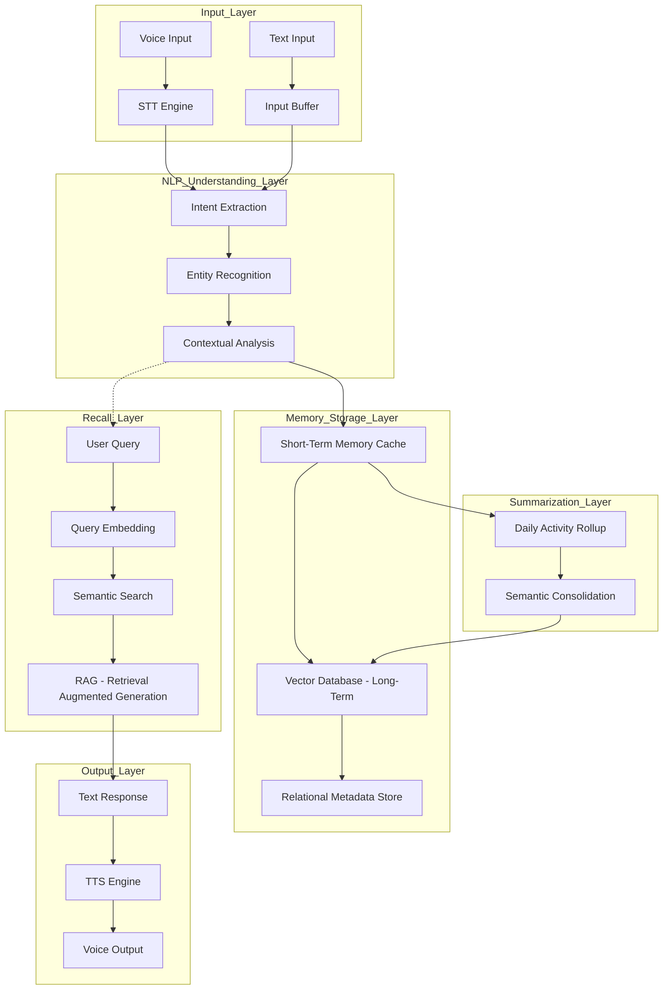

# DeepRecall: AI Human Brain Memory System

DeepRecall is an AI-driven memory augmentation system designed to function like a human brain. it captures, processes, stores, and recalls information seamlessly, providing users with a "digital second brain."

## Architecture Overview

The system is built on a modular architecture that separates perception from cognitive processing and long-term storage.

## Layer Explanations

### 1. Input Layer
*   **Voice Support:** Uses Speech-to-Text (STT) models (e.g., OpenAI Whisper) to convert spoken conversation into text.
*   **Text Support:** Directly accepts text input from chat interfaces or logs.
*   **Streaming:** Supports real-time data ingestion for continuous conversation tracking.

### 2. NLP Understanding Layer
*   **Intent Extraction:** Determines what the user is trying to achieve or what information is being shared.
*   **Entity Recognition (NER):** Identifies people, places, dates, and key objects to tag memories.
*   **Sentiment & Context:** Analyzes the emotional tone and situational context to add depth to stored memories.

### 3. Memory Storage Layer
*   **Short-Term Memory:** A fast-access cache (e.g., Redis) that holds the current conversation state and recent events.
*   **Long-Term Memory:** A Vector Database (e.g., Pinecone, Milvus, or ChromaDB) stores high-dimensional embeddings of past events for semantic retrieval.
*   **Metadata Store:** A structured database (e.g., PostgreSQL) to store timestamps, categories, and links between entities.

### 4. Summarization Layer
*   **Daily Rollup:** Periodically (e.g., every 24 hours) triggers an LLM to summarize the day's activities and interactions.
*   **Consolidation:** Converts detailed logs into concise, high-level "memories" to save space and improve recall efficiency.
*   **Pattern Recognition:** Identifies recurring themes or habits over time.

### 5. Recall Layer
*   **Query Processing:** Converts user questions into vector embeddings.
*   **Semantic Search:** Finds the most relevant memories by calculating cosine similarity in the vector space.
*   **RAG (Retrieval-Augmented Generation):** Feeds retrieved memories into an LLM as context to generate accurate, factual answers about the user's past.

### 6. Output Layer
*   **Response Generation:** Crafts human-like responses based on recalled information.
*   **Text-to-Speech (TTS):** Converts text responses into natural-sounding voice (e.g., ElevenLabs or AWS Polly).
*   **Multi-modal Delivery:** Provides information via chat, notifications, or voice assistants.

## Technical Stack (Recommended)
*   **Language:** Python
*   **LLM:** GPT-4o or Claude 3.5 Sonnet
*   **Vector DB:** ChromaDB (Local) or Pinecone (Cloud)
*   **STT/TTS:** OpenAI Whisper / ElevenLabs
*   **Orchestration:** LangChain or Haystack
